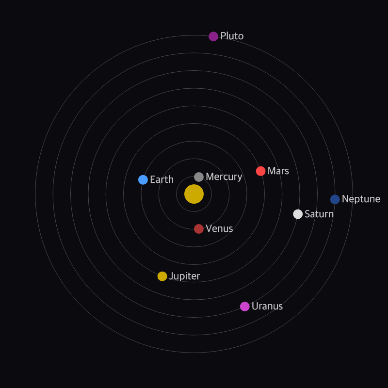

# Edge of Kuiper

```
 ┌────────────────────────────────────┐
 │                                    │
 │   ┌───────────┐     ┌───────────┐  │
 │   │  Transit  │     │  Missions │  │
 │   └───────────┘     └───────────┘  │
 │                                    │
 │   ┌───────────┐     ┌───────────┐  │
 │   │  Mining   │     │ Exploring │  │
 │   └───────────┘     └───────────┘  │
 │                                    │
 │   ┌───────────┐     ┌───────────┐  │
 │   │  Trading  │     │ Investing │  │
 │   └───────────┘     └───────────┘  │
 │                                    │
 │           Edge-of-Kuiper           │
 │      A Real-Time SpaceSim RPG      │
 └────────────────────────────────────┘
```

An async real-time space RPG running as a Discord bot. You captain a ship in the Sol system. Your purpose is to make money and retire.

- Route between planets and stations
- Mine asteroids in the belt and Kuiper Belt
- Trade ore and commodities
- Outfit your ship with better drives and cargo holds
- Take missions, interact with random events
- Hire crew

All interactions are Discord slash commands. Time runs at **7× compression** — 1 real minute is 7 game minutes. Issue an order and come back later.

---

## Lore

The year is 2078. Fusion cores have been miniaturised to the point where they fit inside a bulky freighter. They power torchdrives that make near-constant thrust practical within the Sol system. Trips to Mars take no more than a week or so.

Space is still big, and not much exists beyond the Kuiper Belt — an informal barrier between the orderly inner system, controlled from Earth, and the outer system: less civilised, less regulated, more akin to the old frontier west.

The Kuiper Belt contains untold riches in ice-water, iron, gold, and rare elements.

The perfect time for someone to make a fortune.



---

## Getting started

```bash
npm install
```

**Development — CLI** (no Discord token needed):

```bash
npm run cli -- player create p1 Alice
npm run cli -- player status p1
npm run cli -- route p1 mars
npm run cli -- fasttick          # advance the event queue instantly
```

**Running the bot** (requires a Discord application):

```bash
cp .env.example .env              # fill in DISCORD_TOKEN, CLIENT_ID, GUILD_ID
node src/deploy-commands.js       # register slash commands once
npm start
```

With Docker:

```bash
docker run -it -v "${PWD}:/app" -w /app node:24-slim sh
```

---

## Testing

```bash
npm test                  # all tests
npm run test:unit         # unit tests
npm run test:integration  # integration tests
```

Uses Node's built-in `node:test` — no test framework to install.
`--experimental-sqlite` is required because the game uses Node's built-in SQLite module.

---

## Contributing

All features start with a spec. Before writing code:

1. Read [`specs/README.md`](specs/README.md) for the spec format and workflow.
2. If using GitHub Copilot, type `/spec-planning` in chat — it will ask the right questions and write the spec for you.
3. Get the spec agreed before touching any code.

For architecture invariants and layer boundaries, see [`DESIGN.md`](DESIGN.md).
